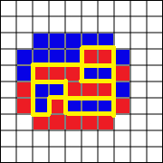
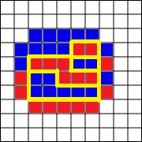
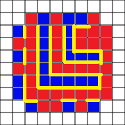
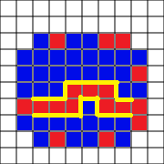

# 海亮2月2日分享

## CF603E

[link](http://codeforces.com/problemset/problem/603/E)

### CF603E题意

给定一张 $n$ 个点的无向图，初始没有边。

依次加入 $m$ 条带权的边，每次加入后询问是否存在一个边集，满足每个点的度数均为奇数。

若存在，则还需要最小化边集中的最大边权。

$n \le 10^5$，$m \le 3 \times 10^5$。

### CF603E题解

首先想想这个条件：要求每个点的度数都是奇数。\
其实这个限制已经很强了：

- 对于一个成立的图，一定不能有一个大小为奇数的联通块。
- 简单证明：每加入一条边，都会改变两个点的度数奇偶性，最开始每个点都是偶数的度数，奇数个点显然不能全都改变成奇数的度数。
- 那联通块大小是偶数就一定都成立吗？
- 一定，你先搞一个联通块的任意生成树，然后从下向上，一旦有的点度数不是奇数，那么就删除向 $fa_u$ 连接的边，这样的话，只有根有可能是不满足的。
- 但是显然是满足的，如果不满足，那么整个联通块的度数之和就是奇数，显然不可能出现这种情况。

于是问题就变成了，每次加入一条边，要求你选择一些边，使得所有的联通块都是偶数的大小，并且希望连接的边最大值最小。

不难联想到`Kruskal`最小瓶颈生成树。

我们发现，我们希望奇数连通块尽可能少（到零）。  
根据小学数学，我们有：

- 奇数+奇数=偶数。
- 偶数+奇数=奇数。
- 偶数+偶数=偶数。

也就是说，我们每次都尽可能的连边，一定不会使得奇数连通块数量增加。  
我们尝试考虑用线段树分治维护哪些边**可能**被加入最小瓶颈生成树。  
然后发现，我们不知道每条边的加入时间区间。  
怎么办呢？  

可以时间倒流，倒着做，那么每条边如果被加入了，一定会保留到被删除的时候。  
然后现在考虑`Kruskal`的指针现在指向 $(u,v)$ 这条边，现在线段树分治正在位置 $i$，这条边在 $w$ 时被删除。  
显然，如果这条边没有在现在这个时间被删除，且存在奇数的连通块，那么一定连接，只需要在 $[w,i - 1]$ 加入这条边即可。  

使用线段树分治，每条边最多被加入 $\log(n)$ 次。  
总的时间复杂度是 $m\log^2(m)\times \alpha(n)$ 的，$4s$ 你怕啥？

## CF1368H1&H2

[link](https://codeforces.com/contest/1368/problem/H1)

### CF1368H1&H2题意

实验板有 $n$ 行 $m$ 列，每个行列交叉处有一个节点。试验板每侧都有端口。左、右侧各 $n$ 个端口，上、下侧各 $m$ 个端口。每个端口是红色或蓝色。

端口可通过导线连接。

- 每根导线连接一红色端口和一蓝色端口，每个端口最多连一条导线。
- 导线的每个部分水平或垂直，最多在一个节点处拐弯。
- 导线不能在节点之外的地方和其他导线相交（也不可以和自己相交）。

试验板的容量是根据上述规则导线数量的最大值。

以下是一种可能的连接方式

注：**Eazy Version**下**没有**修改，也就是说，$q=0$。

端口颜色未固定，有 $q$ 次修改。每次修改，在一条边上的连续区间内，端口颜色反转。

计算每次修改后试验板容量。

$1\le n,m \le 10^5, 0 \le q \le 10^5$。

### CF1368H1题解

首先大家看到这个东西一定能想到网络流叭！

先主动弱化数据范围，到 $n\times m\le500$ 的时候，你会怎么做？

如果将每一个 $(i,j)$ 连向 $(i+1,j),(i,j+1)$（双向边），源点连向红点，蓝点连向汇点，然后跑`Dinic`，那么最大流，也就是最大匹配，就是最终答案。

让我们回到这道题，现在 $n,m\le10^5$，显然如果对每个点都连边会T飞的（

咋办？

这个时候我们发现，再考虑最大流已经很困难了，有着时间复杂度瓶颈。  
我们不妨考虑最小割。

最小割的实质其实是将整张图的所有点分割成两个点集 $S$ 和 $T$。  
我们尝试将 $(x,y)\in S$ 的点 $(x,y)$ 染成红色，将 $(x,y)\in T$ 的点染成蓝色。  

然后考虑最小割在这个图上的实际意义，其实就是所有红蓝点之间边的总长。  

<!-- 

 -->

说起来可能不太好懂，画张图更加形象。  
（源点与汇点之间的不算）
\
那么图中所有红色边长加起来就是整张图的割的代价啦（画了半天QAQ）\
然后我们考虑以下几种优化割（到尽可能最小）。

1. 这个图中不会出现一个完整的不与边界相连的联通块。
   - 同样的，还是上图：
   - 
   - 发现，如果将这里面所有的红点改成蓝点，最小割答案一定变小，反正也和源点没有连边，改变颜色显然更优。
2. 这个图中一定不会出现一条路径，使得只沿着同一种颜色点，能够从一侧不到达相对侧
   - 
   - 不难发现，我们将所有的蓝点变成红点一定会更小。
3. 这个图中一定不会出现折线
   - 
   - 不难发现，将这个折线“捋直了”，黄线会更短。

综上所述，如果我们想让割的代价最小，每一行（列）的颜色一定**相同**。

只不过这里需要注意，行和列是分开算的，选了行相同就**不能**选列相同。  
对于行和列都是同理的，这里给出行的做法，列的做法同理。  

可以设计 $dp_{i,0/1}$ 表示这一行的颜色是黑色还是白色的最小代价。

初始状态（你强制第 $0$ 行是什么颜色，这一行的其他颜色就会产生贡献）：
$$
dp_{0,0}=\sum_{i=1}^m(U_{i}=col)\\
dp_{0,1}=\sum_{i=1}^m(U_{i}\neq col)
$$
注：$col$ 是你之前确定好的颜色（就是不能中间改的意思）

递推式：
$$
dp_{i,0}=\min{dp_{i-1,0},dp_{i-1,1}+m}+(L_i=col)+(R_i=col)\\
dp_{i,1}=\min{dp_{i-1,1},dp_{i-1,0}+m}+(L_i\neq col)+(R_i\neq col)
$$
当然，如果你行匹配好了，列的就没办法匹配了，如果颜色不相同的话就得加上。
$$
dp_{0,0}=\sum_{i=1}^m(D_{i}=col)\\
dp_{0,1}=\sum_{i=1}^m(D_{i}\neq col)
$$
至此，`Eazy Version`就已经做完了。

### CF1368H2题解

在向下看之前请确保你已经看完并看懂了H1题解。

现在带上了修改，怎么办呢？  
同样的，在这里只说行的做法，列的做法类似。

我们发现，$(L_i,R_i)$ 的取值只有四种，递推式子也只有 $2\times2$ 这么大，于是我们不妨考虑线段树+矩阵乘法维护修改。  

在这里定义 $L_i=(ch_i==B),R_i=(ch_i==B)$
具体的，我们维护四个矩阵：
$$
\begin{Bmatrix}
2&m\\
m+2&0\\
\end{Bmatrix}^{(L_i=0,R_i=0)}
$$
$$
\begin{Bmatrix}
1&m+1\\
m+1&1\\
\end{Bmatrix}^{(L_i=1,R_i=0)}
$$
$$
\begin{Bmatrix}
1&m+1\\
m+1&1\\
\end{Bmatrix}^{(L_i=0,R_i=1)}
$$
$$
\begin{Bmatrix}
0&m+2\\
m&2\\
\end{Bmatrix}^{(L_i=1,R_i=1)}
$$
然后线段树维护下就完事了，区间翻转只需要打上相应的标记即可。

